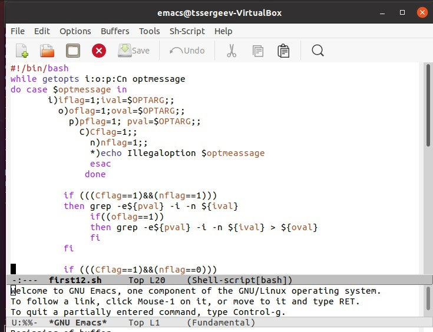
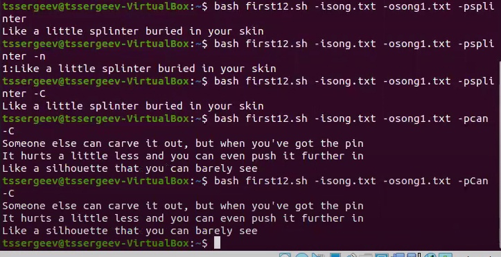
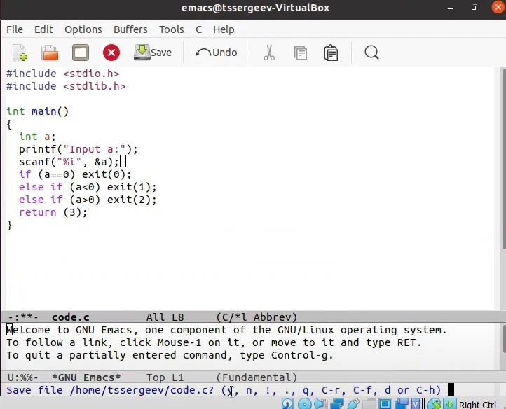
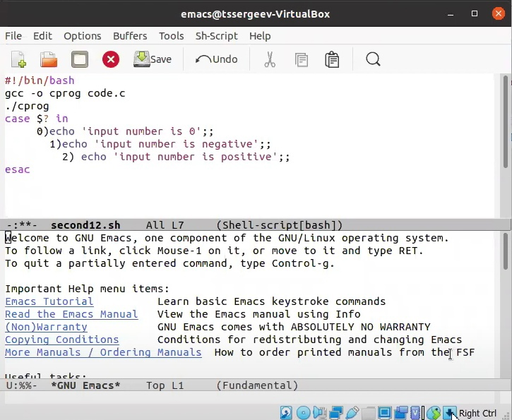
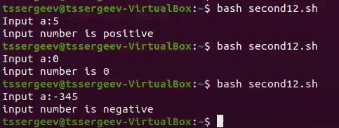
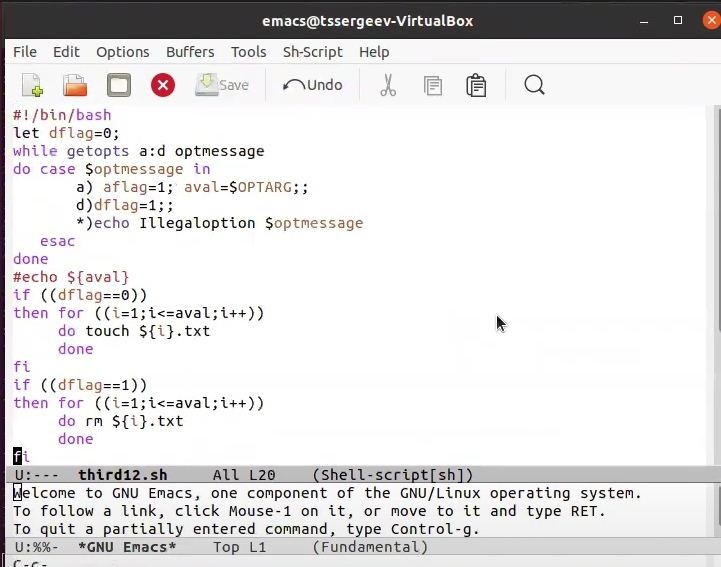
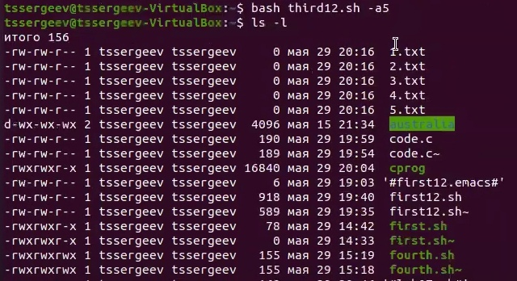
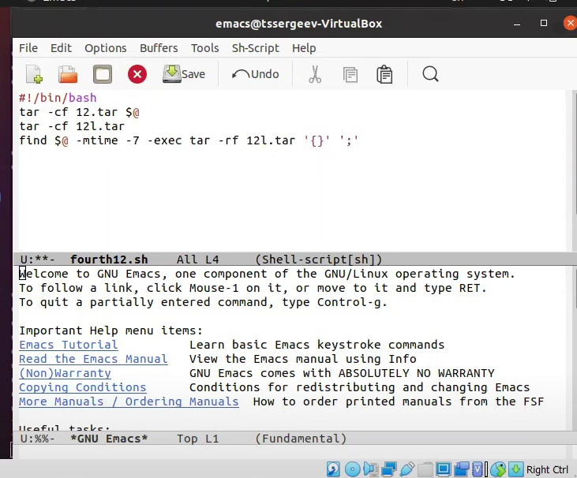
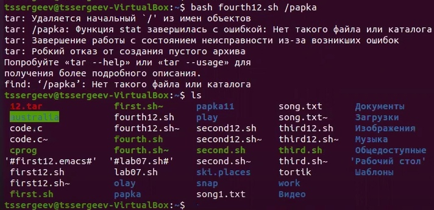

# Отчёт по лабораторной работе №12
## Программирование в командном процессоре ОС UNIX. Ветвления и циклы

---

## Цель выполнения лабораторной работы

Изучить основы программирования в оболочке ОС UNIX. Научиться писать более сложные командные файлы с использованием логических управляющих конструкций и циклов.

---

## Задачи выполнения лабораторной работы

1. Ознакомиться с теоретическим материалом.

2. Выполнить упражнения.

3. Ответить на контрольные вопросы.

---

## Задание 1. 

---

*

---

## Задание 2. 

---

---

---

## Задание 3. 

---

---

## Задание 4. 

---

---

## Вывод

В ходе выполнения поставленных задач я продолжил знакомство с основами программирования в оболочке ОС UNIX/Linux., а именно научился писать более сложные командные файлы с использованием логических управляющих конструкций и циклов.

---

# ***Спасибо за внимание!***
## ʕ ᵔᴥᵔ ʔ

