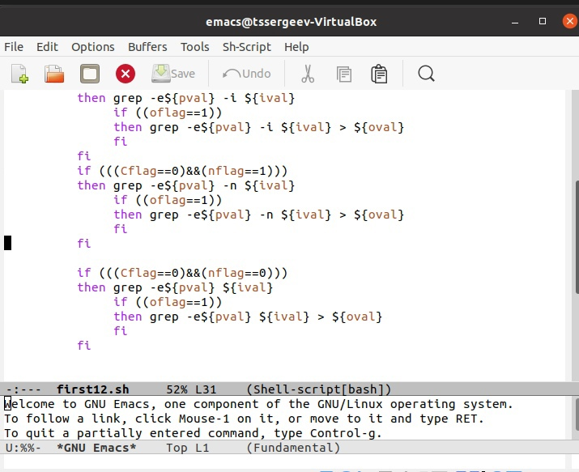
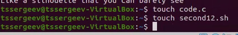
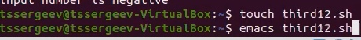
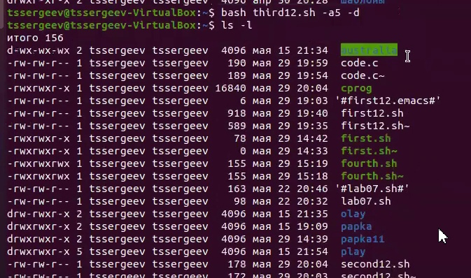
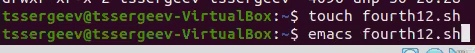

---
# Front matter
lang: ru-RU
title: "Отчет по лабораторной работе №12"
subtitle: "Дисциплина: операционные системы"
author: "Сергеев Тимофей Сергеевич"

# Formatting
toc-title: "Содержание"
toc: true # Table of contents
toc_depth: 2
lof: true # List of figures
lot: true # List of tables
fontsize: 12pt
linestretch: 1.5
papersize: a4paper
documentclass: scrreprt
polyglossia-lang: russian
polyglossia-otherlangs: english
mainfont: PT Serif
romanfont: PT Serif
sansfont: PT Sans
monofont: PT Mono
mainfontoptions: Ligatures=TeX
romanfontoptions: Ligatures=TeX
sansfontoptions: Ligatures=TeX,Scale=MatchLowercase
monofontoptions: Scale=MatchLowercase
indent: true
pdf-engine: lualatex
header-includes:
  - \linepenalty=10 # the penalty added to the badness of each line within a paragraph (no associated penalty node) Increasing the value makes tex try to have fewer lines in the paragraph.
  - \interlinepenalty=0 # value of the penalty (node) added after each line of a paragraph.
  - \hyphenpenalty=50 # the penalty for line breaking at an automatically inserted hyphen
  - \exhyphenpenalty=50 # the penalty for line breaking at an explicit hyphen
  - \binoppenalty=700 # the penalty for breaking a line at a binary operator
  - \relpenalty=500 # the penalty for breaking a line at a relation
  - \clubpenalty=150 # extra penalty for breaking after first line of a paragraph
  - \widowpenalty=150 # extra penalty for breaking before last line of a paragraph
  - \displaywidowpenalty=50 # extra penalty for breaking before last line before a display math
  - \brokenpenalty=100 # extra penalty for page breaking after a hyphenated line
  - \predisplaypenalty=10000 # penalty for breaking before a display
  - \postdisplaypenalty=0 # penalty for breaking after a display
  - \floatingpenalty = 20000 # penalty for splitting an insertion (can only be split footnote in standard LaTeX)
  - \raggedbottom # or \flushbottom
  - \usepackage{float} # keep figures where there are in the text
  - \floatplacement{figure}{H} # keep figures where there are in the text
---

# Цель работы

Изучить основы программирования в оболочке ОС UNIX. Научиться писать более сложные командные файлы с использованием логических управляющих конструкций и циклов.

# Выполнение лабораторной работы

* Управление ходом исполнения -- один из ключевых моментов структурной организации сценариев на языке командной оболочки. Циклы и преходы являются теми инструментальными средствами, которые обеспечивают управление порядком исполнения команд.^[1]^
* В большинстве языков программирования существует несколько типов циклов. Большинство из них поддерживаются оболочкой Bash. Bash позволяет использовать циклы как в скриптах, так и непосредственно в командной оболочке.^[2]^

* **Задание 1.**

* Используя команды getopts grep, написать командный файл, который анализирует командную строку с ключами:
– -iinputfile — прочитать данные из указанного файла;
– -ooutputfile — вывести данные в указанный файл;
– -pшаблон — указать шаблон для поиска;
– -C — различать большие и малые буквы;
– -n — выдавать номера строк.
а затем ищет в указанном файле нужные строки, определяемые ключом -p.

-Создадим файл с текстом формата .txt, с которым будем работать в дальнейшем, и командный файл first12.sh

*Рисунок 1:*

*Рисунок 2:*

-Текст,который я ввел в текстовый файл:

> Like a little splinter buried in your skin
>  
> Someone else can carve it out, but when you've got the pin
> 
> It hurts a little less and you can even push it further in
> 
> When your body's screaming out, trust your mind's listening
> 
> Like a silhouette that you can barely see
> 
> As a shadow cast upon the ground where you'll eventually
> 
> Lay forever, but the day goes on, the sun moves behind you
> 
> You get taller, bolder, stronger and the rear view only blinds you

-Пишем командный файл в соответствии с условием:

*Рисунок 3:*

*Рисунок 4:*

-Теперь вызовем командный файл и проверим работу всех ключей:

*Рисунок 5:*

*

* **Задание 2.**

* Написать на языке Си программу, которая вводит число и определяет, является
ли оно больше нуля, меньше нуля или равно нулю. Затем программа завершается
с помощью функции exit(n), передавая информацию в о коде завершения в
оболочку. Командный файл должен вызывать эту программу и, проанализировав
с помощью команды $?, выдать сообщение о том, какое число было введено.

-Создадим файл с программой на языке С формата .с, с которым будем работать в дальнейшем, и командный файл second12.sh

*Рисунок 6:*

-Теперь напишем программу, которая вводит число и определяет, является
ли оно больше нуля, меньше нуля или равно нулю.

*Рисунок 7:*

-Далее следует написать командный файл вызова этой программы и вывода сообщения о том, какое число было введено.

*Рисунок 8:*

-Запустим командный файл и проверим три значения: 5(положительное), 0, -345(отрицательное):

*Рисунок 9:*

В итоге, все сообщения были выведены верно.

* **Задание 3.**

* Написать командный файл, создающий указанное число файлов, пронумерованных последовательно от 1 до N (например 1.tmp, 2.tmp, 3.tmp,4.tmp и т.д.).
Число файлов, которые необходимо создать, передаётся в аргументы командной
строки. Этот же командный файл должен уметь удалять все созданные им файлы
(если они существуют).

-Создадим необходимый командный файл third12.sh и откроем его через emacs:

*Рисунок 10:*

-Напишем командный файл так, чтобы он соответствовал условию, а именно создавал файлы, а после - со специальным ключом удалять их:

*Рисунок 11:*

-Вызовем командный файл и укажем количество создаваемых файлов, после выведем содержимое каталога:

*Рисунок 12:*

-Вызовем его вновь, но теперь с ключом -d:

*Рисунок 13:*

* **Задание 4.**

* Написать командный файл, который с помощью команды tar запаковывает в
архив все файлы в указанной директории. Модифицировать его так, чтобы запаковывались только те файлы, которые были изменены менее недели тому назад
(использовать команду find).

-Создадим необходимый командный файл fourth12.sh и откроем его через emacs:

*Рисунок 14:*

-Напишем командный файл так, чтобы он соответствовал условию, а именно запаковывал файлы указанной директории:

*Рисунок 15:*

-Вызовем командный файл и укажем директорию, после выведем содержимое:

*Рисунок 16:*

# Выводы

В ходе выполнения поставленных задач я продолжил знакомство с основами программирования в оболочке ОС UNIX/Linux., а именно научился писать более сложные командные файлы с использованием логических управляющих конструкций и циклов.

# Библиография
* [1] https://www.opennet.ru/docs/RUS/bash_scripting_guide/c4875.html
* [2] https://losst.ru/tsikly-bash

# Контрольные вопросы

1.Команда getopts является встроенной командой командной оболочки bash, предназначенной для разбора параметров сценариев. Она обрабатывает исключительно однобуквенные параметры как с аргументами, так и без них и этого

вполне достаточно для передачи сценариям любых входных данных.

2.При генерации имен используют метасимволы:

* произвольная (возможно пустая) последовательность символов;

? один произвольный символ;

[...] любой из символов, указанных в скобках перечислением и/или с указанием диапазона;

cat f* выдаст все файлы каталога, начинающиеся с "f";

cat *f* выдаст все файлы, содержащие "f";

cat program.? выдаст файлы данного каталога с однобуквенными расширениями, скажем "program.c" и "program.o", но не выдаст "program.com";

cat [a-d]* выдаст файлы, которые начинаются с "a", "b", "c", "d". Аналогичный эффект дадут и команды "cat [abcd]*" и "cat [bdac]*".

3. Операторы && и || являются управляющими операторами. Если в командной строке стоит command1 && command2, то command2 выполняется в том, и только в том случае, если статус выхода из команды command1 равен нулю, что говорит об успешном ее завершении. Аналогично, если командная строка имеет вид command1 || command2, то команда command2 выполняется тогда, и только тогда, когда статус выхода из команды command1 отличен от нуля.

4. Оператор break завершает выполнение ближайшего включающего цикла или условного оператора, в котором он отображается.

5. Команда true всегда возвращает ноль в качестве выходного статуса для индикации успеха. Команда false всегда возвращает не-ноль в качестве выходного статуса для индикации неудачи. Во всех управляющих конструкциях в качестве логического значения используется код возврата из программы, указанной в качестве условия. Код возврата 0 – истина, любое другое значение – ложь. Программа true – всегда завершается с кодом 0, false – всегда завершается с кодом 1.

6. Введенная строка означает условие существования файла man$s/$i.$s

7. Цикл While выполняется до тех пор, пока указанное в нем условие истинно. Когда указанное условие становится ложным - цикл завершается. Цикл Until выполняется до тех пор, пока указанное в нем условие ложно.